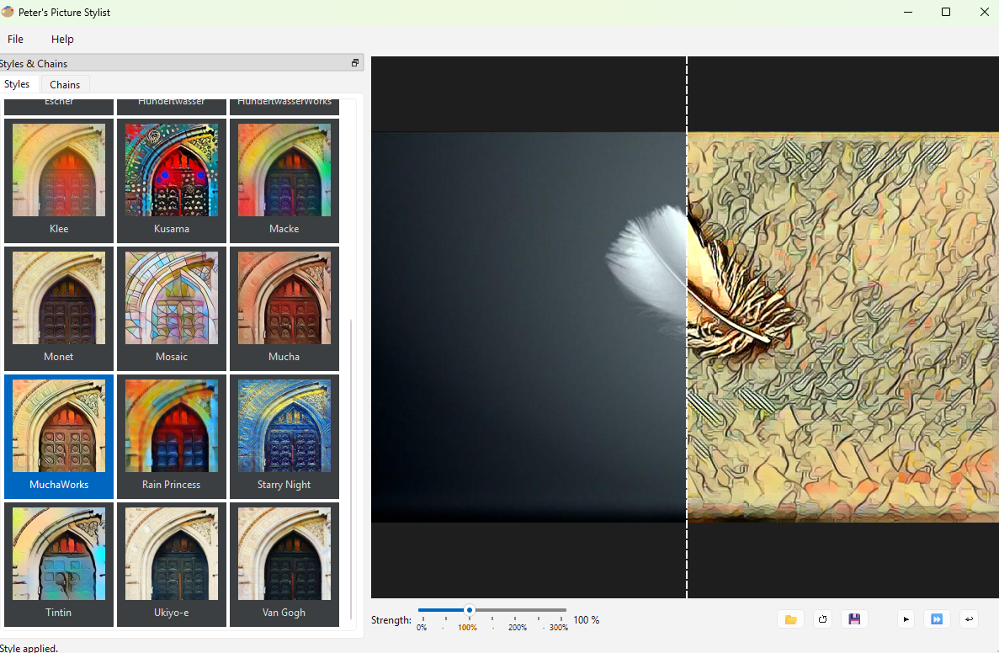
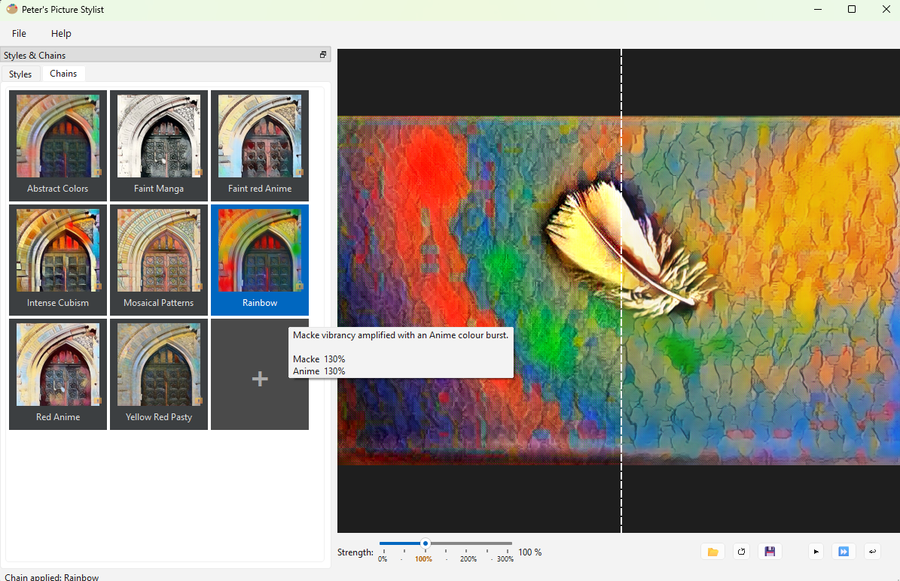

# Peter's Picture Styler

**Peter's Picture Styler** is a Windows desktop application that reimagines your photos as paintings — using fast neural style transfer to apply the visual character of famous artists to any image in seconds.

Under the hood every model runs through ONNX Runtime with optional DirectML GPU acceleration.  No GPU is required to use the app, and no Python knowledge is needed: just copy the compiled folder and double-click.

### Styles

The app ships with **21 built-in styles** drawn from three sources:

| Source | Examples |
|---|---|
| Publicly available CNN (TransformerNet) checkpoints | Candy, Mosaic, Rain Princess, Starry Night, Udnie |
| Official CycleGAN generators (junyanz) | Monet, Van Gogh, Cézanne, Ukiyo-e |
| Self-trained CNN models (multi-image Gram matrix) | Anime, Cubism, Escher, Hundertwasser, Klee, Kusama, Macke, Manga, Mucha, Tintin, … |

Pick a style from the thumbnail gallery, drag the **Strength** slider (0 % – 300 %), and a split before/after view updates live.



### Style Chains

A style chain applies two or more styles in sequence, each at its own strength, to produce looks that no single model can achieve on its own.  The app ships with **8 predefined chains** (Abstract Colors, Faint Manga, Faint red Anime, Intense Cubism, Mosaical Patterns, Rainbow, Red Anime, Yellow Red Pasty).

Creating a new chain is fully **WYSIWYG**: switch to the *Chains* tab, click the **+** tile, pick styles and strengths, give it a name and description, and save.  The chain is written to a YAML file and immediately available in the gallery — no recompile needed.  Hover any chain tile to see its recipe.



---

## Features

- **21 built-in styles** — publicly available CNNs, official CycleGAN GANs, and self-trained CNNs
- **8 predefined style chains** — multi-step recipes for unique looks
- **WYSIWYG chain editor** — compose new chains in the GUI without touching any files
- **Tiled inference** — handles large photos without running out of GPU memory
- **Strength slider** — blend between original and styled result (0 % – 300 %)
- **Batch Styler CLI** — apply styles or chains to single images, iterate randomly over directories, or generate overview contact sheets — all headless, no GUI
- **Portable exe** — copy `dist\PetersPictureStyler\` and double-click, no install needed
- **Extensible** — train new styles on Kaggle (free GPU) and drop them in without recompiling

---

## Quick Start (compiled app)

1. Copy the entire `dist\PetersPictureStyler\` folder to your machine
2. Double-click `PetersPictureStyler.exe` — no Python or dependencies needed
3. Open a photo · pick a style · click Apply · save the result

**Add a new style without recompiling:**
1. Drop the style folder (containing `model.onnx`) into `PetersPictureStyler\styles\`
2. Append the entry to `PetersPictureStyler\styles\catalog.json`
3. Restart the app — the new style appears in the gallery

---

## Run from Source

```powershell
# 1. Create venv and install dependencies
python -m venv .venv
.venv\Scripts\pip install -e ".[stylist]"

# 2. Launch
.venv\Scripts\python.exe main_image_styler.py
```

---

## Build the App

```powershell
.\compile.ps1        # produces dist\PetersPictureStyler\
```

Requires PyInstaller in the venv (`pip install pyinstaller`). torch/torchvision are excluded — inference uses ONNX Runtime only.

The build produces a **directory** (not a single exe). The `styles\` folder is copied in after compilation so styles remain editable without recompiling. Intermediate stub EXEs at `dist\` root are removed automatically by the spec file.

---

## Batch Styler CLI

`BatchStyler.exe` (headless, no GUI) is the power-user companion to the desktop app.  It can:

- **Apply a single style or chain to one image** and save the result as a JPEG
- **Randomly iterate over a directory** of photos, picking a random style or chain for each, so you can explore a large collection quickly
- **Generate contact-sheet PDFs** showing every style (or every chain) applied to a reference photo at multiple strengths — great for picking the right look before committing

```powershell
cd dist\PetersPictureStyler

# Apply one style to one photo
.\BatchStyler.exe --apply-style Mosaic photos\photo.jpg --outdir C:\out

# Apply one chain to one photo
.\BatchStyler.exe --apply-style-chain sample_images\style-chains\rainbow.yml photos\photo.jpg --outdir C:\out

# Randomly style every photo in a directory (one random style each)
.\BatchStyler.exe --random-style --input-dir photos\ --outdir C:\out

# PDF contact sheet — all 21 styles at multiple strengths
.\BatchStyler.exe --style-overview --outdir C:\out photos\photo.jpg

# PDF overview — all style chains in a directory
.\BatchStyler.exe --style-chain-overview sample_images\style-chains --outdir C:\out photos\photo.jpg
```

Progress is printed per-style with timing and a running count:
```
(1/21) Processing style 'Abstract' in 33 seconds.
(2/21) Processing style 'Anime' in 28 seconds.
...
PDF written: C:\out\photo_style_overview.pdf
```

Full option reference: `.\BatchStyler.exe --help`

### Batch scripts

`scripts\create_sample_overview.bat` runs both overview modes for every photo in
`sample_images\sample_pics\` and writes PDFs to `sample_images\style-overviews\`
and `sample_images\style-chain-overviews\`.

`scripts\sample_pic_slide_gen.bat` randomly styles every sample photo and assembles
the results into an MP4 slideshow using an external `slidegen.exe`.

---

## Train a New Style

Training requires a GPU. The easiest free option is Kaggle (30 h/week GPU T4 × 2).
See **[training/index.md](training/index.md)** for the full step-by-step guide.

### Experiment with your own artist selection

`training/kaggle_multi_pic_trainer.ipynb` is the recommended starting point for creating a brand-new style.  Instead of learning from a single painting it computes a **mean Gram matrix across N images** — any set of artworks you like.  Just upload your style images to a Kaggle dataset, point the notebook at it, and run all cells.  The result is a TransformerNet `.onnx` that captures the collective texture and colour palette of your chosen artists.

Typical workflow:

1. Collect 5–30 images from your target artist(s) and upload them as a Kaggle dataset
2. Open `training/kaggle_multi_pic_trainer.ipynb` on Kaggle, add the COCO-2017 content dataset and your style dataset, enable GPU T4
3. Run all cells — training takes ~3 h for 2 epochs
4. Download the `.onnx` from the Output tab
5. Run `training/add_CNN_style.ipynb` locally to register the new style in the gallery
6. Rebuild with `.\compile.ps1`

For a single reference painting use `training/kaggle_trainer.ipynb` instead (same steps, simpler config).

> **Analyse before training:** `scripts/style_analysis.ipynb` scores your style image,
> recommends weights, and runs a local CPU smoke test before committing to the full Kaggle run.

---

## Project Layout

```
src/
  stylist/      Qt/PySide6 GUI app (no torch)
    apply_controller.py       ← style-apply mixin
    style_chain_controller.py ← chain-management mixin
    help_dialogs.py           ← standalone help dialogs
  batch_styler/ Headless CLI for overview PDFs
  trainer/      Training pipeline (torch, dev only)
  core/         Shared ONNX inference, registry, settings, style-chain schema
styles/         Pretrained ONNX models + catalog.json
training/       Training notebooks + helpers (see training/index.md)
scripts/        Analysis tools, helper scripts (see scripts/index.md)
bin/            Subprocess entry points for trainer (memory isolation from GUI)
docs/           Architecture notes, refactoring plan
sample_images/  Sample photos, style chains, overview output
assets/         App icon
main_image_styler.py    → thin stub: launches src.stylist.app:main
main_style_trainer.py   → thin stub: launches src.trainer.app:main
compile.ps1             → build the portable app directory (dist\PetersPictureStyler\)
style_transfer.spec     → PyInstaller spec (PetersPictureStyler + BatchStyler)
```

---

## Tests

```powershell
# Fast suite (~8 s, 341 tests)
.venv\Scripts\python.exe -m pytest tests/ -q --tb=short --ignore=tests/trainer/test_multi_pic_gram.py
```

---

## Credits

**Pretrained models**

- [yakhyo/fast-neural-style-transfer](https://github.com/yakhyo/fast-neural-style-transfer) (MIT) — CNN TransformerNet checkpoints
- [igreat/fast-style-transfer](https://github.com/igreat/fast-style-transfer) (MIT) — additional CNN checkpoints
- **CycleGAN** (BSD) — unpaired image-to-image translation; Monet, Van Gogh, Cézanne, Ukiyo-e styles.  
  Original paper: Zhu et al., 2017 — [junyanz.github.io/CycleGAN](https://junyanz.github.io/CycleGAN/)
- **AnimeGAN v2** (MIT) — photo-to-anime conversion.  
  Original repo: [github.com/TachibanaYoshino/AnimeGANv2](https://github.com/TachibanaYoshino/AnimeGANv2)

**Training infrastructure**

- [Kaggle](https://www.kaggle.com/) — free GPU compute (T4 × 2) used to train new styles
- [Fast Neural Style Transfer](https://www.kaggle.com/code/yashchoudhary/fast-neural-style-transfer) notebook by Yash Choudhary — reference Kaggle training setup

**Research references**

- Gatys et al. (2015) — [A Neural Algorithm of Artistic Style](https://arxiv.org/pdf/1508.06576) — the original NST paper using iterative optimisation
- Johnson et al. (2016) — [Perceptual Losses for Real-Time Style Transfer and Super-Resolution](https://arxiv.org/pdf/1603.08155) — the feed-forward network used in this app
- Ulyanov et al. (2017) — [Instance Normalization: The Missing Ingredient for Fast Stylization](https://arxiv.org/abs/1607.08022) — Instance Normalization in place of Batch Normalization

**Built with** Python, PySide6, and ONNX Runtime.  
**Special thanks:** Claude Sonnet 4.6 (Anthropic) — advice and coding.

